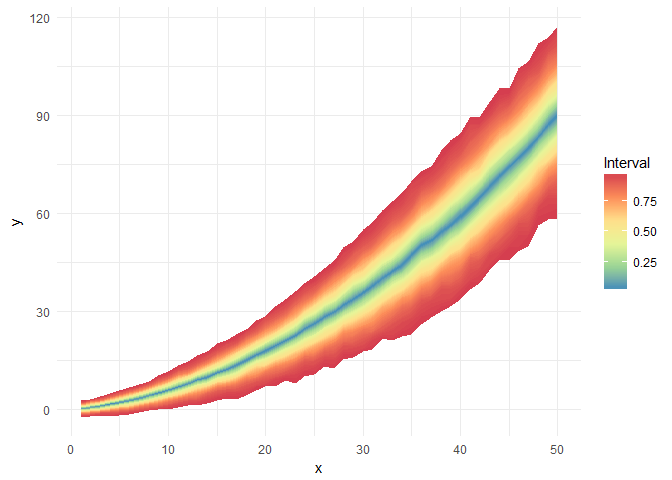

ggfan
================
Jason Hilton
05 March, 2019

[](https://travis-ci.org/jasonhilton/ggfan)

## Summarise a distribution through coloured intervals

This package is a ggplot-based implementation of some of the
functionality of the [`fanplot`
package](https://gjabel.wordpress.com/category/r/fanplot/) by Guy Abel.
Fanplot provides methods to visualise probability distributions by
representing intervals of the distribution function with colours.
Plotting samples from posterior distributions obtained through MCMC is a
particular aim. A ggplot-based implementation is useful as it allows
leverage of the power of [ggplot2](http://ggplot2.tidyverse.org/)
features allowing, for example, facetting and easy theming.

## Installation

Installation directly from CRAN should be possible shortly, once the
package has been resubmitted and checked: `install.packages("ggfan")`
Otherwise, the package can be installed directly from github using the
devtools package: `devtools::install_github("jasonhilton/ggfan")`.

## Quick Start

The provided `fake_df` data gives and example of the type of data you
might want to plot with ggfan: it consists of 1000 samples of an outcome
variable of interest at each value of a covariate `x`. We can plot this
simply using standard `ggplot2` syntax and `geom_fan`. Convenient
`ggplot` features such as themes, colour scales and facetting can also
be
used.

``` r
ggplot(fake_df, aes(x=x, y=y)) + geom_fan() + theme_minimal() + scale_fill_distiller(palette="Spectral")
```

<!-- -->

## Further Information

A full description of the functionality of `ggfan` is provided in the
vignette, provided
[here](https://github.com/jasonhilton/ggfan/blob/master/vignettes/geom_fan.md).

A brief example of using `ggfan` to plot `stan` output is given in a
second vignette
[here](https://github.com/jasonhilton/ggfan/blob/master/vignettes/ggfan_stan.md)
