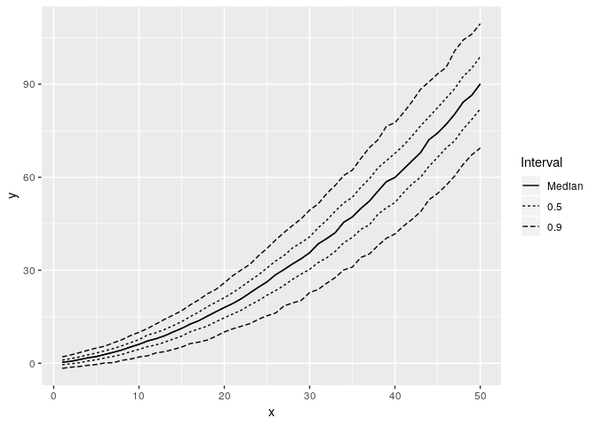
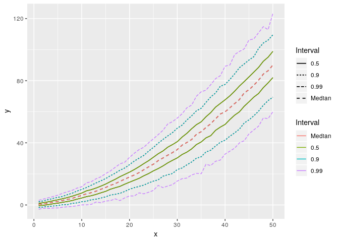
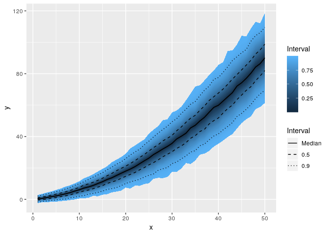
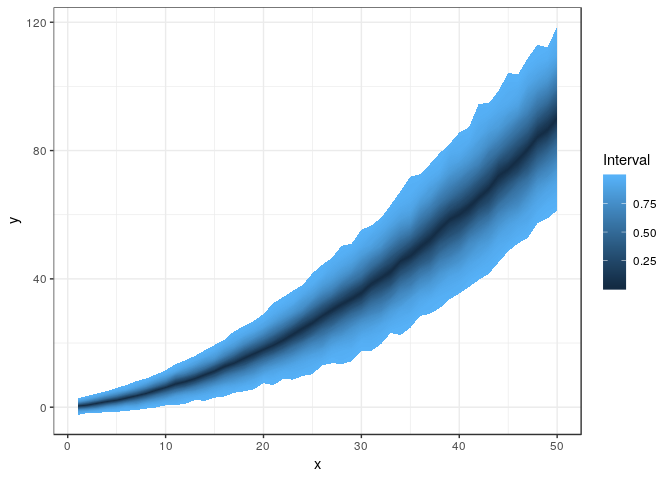
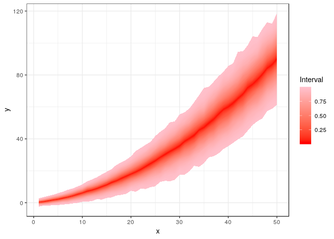
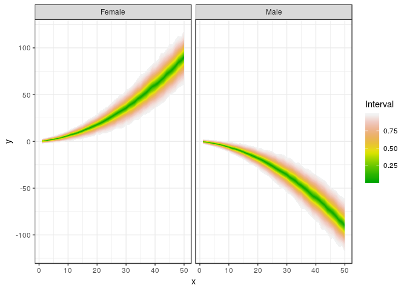
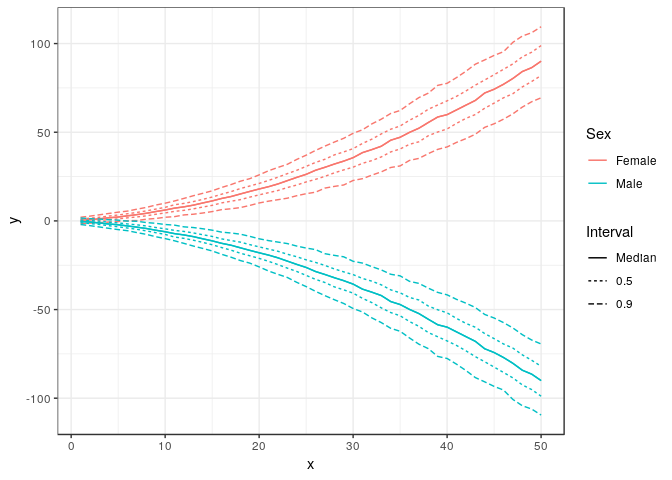
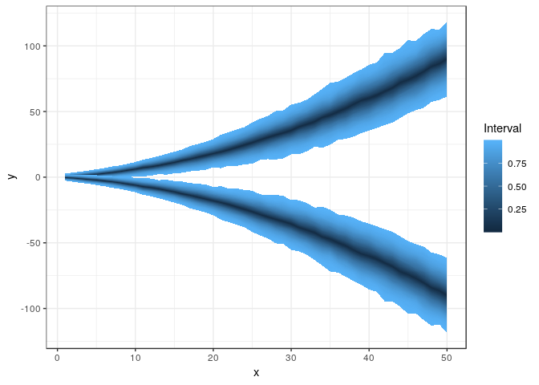

Using ggfan to plot a distribution
================
Jason Hilton
2017-11-14

Introduction
============

This package is a `ggplot`-based implementation of some of the functionality of (`fanplot` package)\[<https://gjabel.wordpress.com/category/r/fanplot/>\] by Guy Abel. The `fanplot` package provides methods to visualise probability distributions by representing intervals of the distribution function with colours. A `ggplot` implementation of the package is useful as it allows leverage of the power of `ggplot` features allowing, for example, facetting and easy theming. This vignette aims to demonstrate some simple features of `ggfan`.

Please let me know if I anything is not clear in this vignette, or if you think any additions or ammendments I need to make to the package. Similarly, if you spot any bugs or errors let me know. The [github issue page](https://github.com/jasonhilton/ggfan/issues) is the best place for dealing with this.

For convenience, a few other libraries are used during the vignette

``` r
library(ggplot2)
library(magrittr)
library(tidyr)
```

    ## Warning: package 'tidyr' was built under R version 3.4.2

    ## 
    ## Attaching package: 'tidyr'

    ## The following object is masked from 'package:magrittr':
    ## 
    ##     extract

``` r
library(dplyr)
```

    ## Warning: package 'dplyr' was built under R version 3.4.2

    ## 
    ## Attaching package: 'dplyr'

    ## The following objects are masked from 'package:stats':
    ## 
    ##     filter, lag

    ## The following objects are masked from 'package:base':
    ## 
    ##     intersect, setdiff, setequal, union

``` r
library(ggfan)
```

Example with simulated data
===========================

We will create some fake data for the purposes of demonstrating the `geom_fan` function. Imagine the data we are creating is, for example, a set of posterior samples obtained through MCMC sampling.

Following 'tidyverse' convention, `ggfan` uses long-form data only, so that each row is one sample of the distribution in question at a given covariate value.

``` r
# generate mean and variance for sequence of samples over time
N_time <- 50
N_sims <- 1000 
time <- 1:N_time
mu <- time**2 * 0.03 + time * 0.3
sds <- exp(time**2 * -0.001 + time * 0.1)

# simulate 1000 samples from each time point
fake_data <- sapply(time, function(i) rnorm(N_sims, mu[i], sds[i]))

# gather into a long-form, tidy dataset
fake_df <- data.frame(x=time, t(fake_data)) %>% gather(key=Sim, value=y, -x)

head(fake_df)
```

    ##   x Sim         y
    ## 1 1  X1 1.3948458
    ## 2 2  X1 1.2918445
    ## 3 3  X1 1.0502027
    ## 4 4  X1 1.1772656
    ## 5 5  X1 0.8996833
    ## 6 6  X1 3.2891427

Now that we have a data set, let's visualise it using `ggfan`.

Firstly, we can summarise the distribution by ploting lines connecting upper and lower boundaries of central probability intervals using `stat_interval`. This calculates the intervals, and by default associates these with the `linetype` aesthetic. The precise intervals to be plotted can be specified. The 'zero' interval here describes the median.

``` r
p <- ggplot(fake_df, aes(x=x,y=y)) + geom_interval()
print(p)
```

    ## Warning: package 'bindrcpp' was built under R version 3.4.1



``` r
p + geom_interval(aes(colour=..Interval..), intervals=c(0,0.5,0.9,0.99))
```



We can also try and describe the distribution in a more comprehensive manner by using `geom_fan`.

``` r
p <- ggplot(fake_df, aes(x=x,y=y)) + geom_fan()
print(p)
```


The `geom_fan` geometry is associated with an Interval `stat`, which calculates the empirical quantiles of the variable that is mapped to `y`, and returns a data frame with the location of central intervals estimated to contain increasing percentages of the total density. These increasing intervals are then mapped to a `ggplot` (or `scales`) continuous colour scale.

We can combine this with `stat_interval` to emphasise particular intervals by using two layers on the same plot. Customising the `linetype` scale is also possible, as shown below. Using dotted lines to indicate more extreme intervals seems more natural to me.

``` r
ggplot(fake_df, aes(x=x, y= y)) + geom_fan() + geom_interval() + 
  scale_linetype_manual(values=c("solid", "dashed", "dotted"))
```



In this case, we know the theoretical quantiles of the distribution, as we generated from a normal distribution, so we can check the estimated intervals correspond to what we expect. We should see that the 25th and 75th quantile correspond approximately to the colour band for the 50% interval.

``` r
quants <- c(2.5,10,25,50,75,90,97.5) 
q_df <- as.data.frame(sapply(quants*0.01, qnorm, mu, sds))

names(q_df) <-  gsub("^","q", quants)
q_df <- cbind(q_df,time)
q_df <-gather(q_df,key=quantile, value=value, -time)

p + geom_line(data=q_df, mapping=aes(x=time,y=value, group=quantile, linetype=quantile))
```


Adding individual sample realisations
-------------------------------------

One problem with plots of this nature is that they give a false impression of order, as one gets the idea that individual samples must follow the paths similar to those implied by the quantiles. A solution to this problem is to add a layer with just a few random samples to show possible paths actually implied by the posterior, as can be done with the original `fanplot` package. The `stat_sample` stat allows this, and may be customised through all the same arguments as `geom_path`, upon which it is based.

``` r
set.seed(53)
ggplot(fake_df, aes(x=x,y=y)) + geom_fan() + 
  stat_sample(aes(group=Sim), n_samples=7, size=0.2, alpha=1)
```


This plot looks uglier than it might; in real data, we might expect correlation in each sample of *y* at adjacent values of *x*, giving smoother lines.

Plotting with pre-computed quantiles
------------------------------------

In the case where the data we wish to visualise is very large, we may wish to work directly with the quantiles to avoid repeated memory-intensive operations. This is possible through the specification of a quantile aesthetic when constructing the plot.

``` r
fake_q <-  fake_df %>% calc_quantiles(intervals=(1:99)/100) 

names(fake_q)
```

    ## [1] "x"        "quantile" "y"

``` r
dim(fake_df); dim(fake_q)
```

    ## [1] 50000     3

    ## [1] 9900    3

``` r
ggplot(fake_q,  aes(x=x,y=y,quantile=quantile)) + geom_fan()
```


Customising ggfan characteristics
---------------------------------

I think this kind of plot looks better with a white background, not the classic `ggplot` grey. The implementation as a `geom` means we can easily change this by applying a different theme.

``` r
ggplot(fake_df, aes(x=x,y=y)) + geom_fan() + theme_bw()
```



We can also change the colour scale associated with the probability intervals. Here we use the rather colourful spectral palette, and also specify high and low colours as pink and red respectively. The user may prefer to come up with their own scale.

``` r
ggplot(fake_df, aes(x=x,y=y)) + geom_fan() + theme_bw() + scale_fill_distiller(palette="Spectral")
```


``` r
ggplot(fake_df, aes(x=x,y=y)) + geom_fan() + theme_bw() + scale_fill_gradient(low="red", high="pink")
```



You can also specify the intervals you want to use for `geom_fan`. If we specifiy just the 50%, 80% and 95% intervals, we can see these match up approximately with the relevant quantiles of the theoretical distribution. These do not match exactly because we only obtained a finite sample from the distribution - large sample sizes provide greater accuracy.

``` r
ggplot(fake_df, aes(x=x, y=y)) + geom_fan(intervals=c(50,80,95)/100) +
  theme_bw() + geom_line(data=q_df, mapping=aes(x=time,y=value, group=quantile, linetype=quantile))
```


Grouping and Facetting
----------------------

If we want to plot more than one fan for different categories, we can use facetting. First of all, let's create some new fake data by just negating the existing series:

``` r
fake_df_sex <- fake_df %>% mutate(y=-fake_df$y, Sex="Male")

fake_df_sex <- rbind(fake_df %>% mutate(Sex="Female"), fake_df_sex)

ggplot(fake_df_sex, aes(x=x,y=y)) + geom_fan() + theme_bw() + scale_fill_gradientn(colours = terrain.colors(10)) + facet_wrap(~Sex)
```



We can also display the distributions on the same axes using `geom_interval`, in order to facilitate better comparison.

``` r
p <- ggplot(fake_df_sex, aes(x=x, y=y,group=Sex,colour=Sex)) + geom_interval() + theme_bw()
print(p)
```



This is also possible using `geom_fan`, although because at the moment it is not possible to assign different colour scales to each group, this is less useful.

``` r
p <- ggplot(fake_df_sex, aes(x=x, y=y,group=Sex)) + geom_fan() +theme_bw()
print(p)
```



Alternatives
------------

There are existing geoms that do similar jobs, but nothing quite the same. The `stat_quantile` stat fits model-based quantiles to the data, while the various density stats and geoms also work to summarise probability distributions. The `stat_summary` provides functions to summarise `y` values for each value of `x`, as is done here, but does not provide for fan-like geoms.

Limitations
-----------

One potential problem with the approach here is the interpolation between neighbouring x-values. There is a underlying assumption that the `x` value is continuous and can be smoothly interpolated between `x` and `x + 1`.
