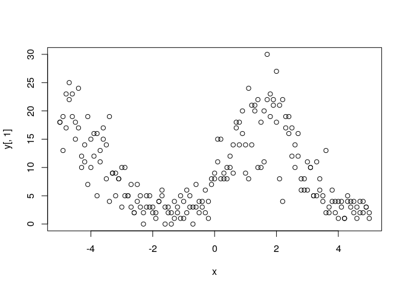
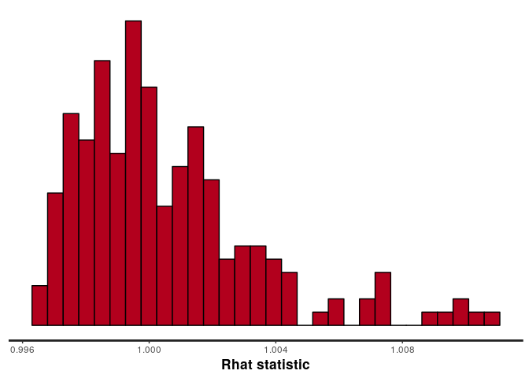
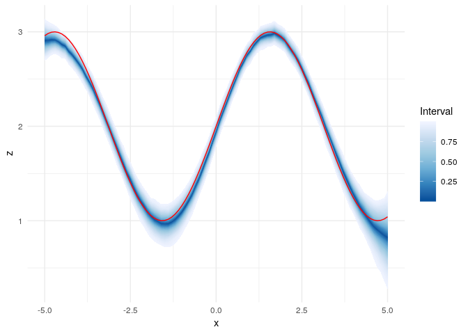

Using ggfan with stan
================
Jason Hilton
2019-03-06

``` r
library(rstan)
```

    ## Loading required package: StanHeaders

    ## rstan (Version 2.18.2, GitRev: 2e1f913d3ca3)

    ## For execution on a local, multicore CPU with excess RAM we recommend calling
    ## options(mc.cores = parallel::detectCores()).
    ## To avoid recompilation of unchanged Stan programs, we recommend calling
    ## rstan_options(auto_write = TRUE)

    ## 
    ## Attaching package: 'rstan'

    ## The following object is masked from 'package:tidyr':
    ## 
    ##     extract

    ## The following object is masked from 'package:magrittr':
    ## 
    ##     extract

``` r
library(dplyr)
library(magrittr)
library(tidyr)
library(tibble)

library(ggfan)
```

The `ggfan` package can be used to plot output from common mcmc sampling programs. As an example we will fit a latent gaussian process model to some simulated count data using stan. First, we simulate some data and plot it. We simulate two observations at each x value, with the count outcome values depending on a sinusoidal latent rate variable.

``` r
seed <- 34526
set.seed(seed)

# data 
x <- seq(-5,5,0.1)
N <- length(x)
y <- cbind(rpois(N, exp(sin(x)+2)),rpois(N, exp(sin(x)+2)))

stan_data <- list(N=N, x=x, y=y)

plot(x,y[,1])
points(x,y[,2])
```



The stan model used is a modified version of the Gaussian Process (GP) examples bundled with `rstan`, and is also based on the latent-variable discussion in the Bayesian Data Anaylsis edition 3 (Gelman et al. 2015). GPs are semi-parametric models based on the assumption that outcomes are joint multivariate normal, and that observations that are close to each other in terms of their covariate values are correlated in outputs.

The model is given below. The details are not especially important for this purpose, but for those familiar with GPs, the roughness and variance parameters are estimated as part of the model, but a small fixed nugget is added to the diagonal to avoid numerical problems. The model can be compiled by saving the code below in a text file and reading in using `stan_model(file="path/to/model.stan")`.

``` stan
data {
  int<lower=1> N;
  vector[N] x;
  int<lower=0> y[N,2];
}
transformed data {
  vector[N] mu;
  for (i in 1:N)
    mu[i] = 0;
}
parameters {
  real<lower=0> eta_sq;
  real<lower=0> rho_sq;
  vector[N] z;
}
model {
  matrix[N,N] Sigma;

  // off-diagonal elements
  for (i in 1:(N-1)) {
    for (j in (i+1):N) {
    Sigma[i,j] = eta_sq * exp(-rho_sq * pow(x[i] - x[j],2));
      Sigma[j,i] = Sigma[i,j]; // for symmetry
    }
  }

  // diagonal elements
  for (k in 1:N){
    Sigma[k,k] = eta_sq + 0.001; // nugget for numeric purposes
  }

  eta_sq ~ cauchy(0,5);
  rho_sq ~ cauchy(0,5);

  z ~ multi_normal(mu, Sigma);
  for (j in 1:2){
    y[,j] ~ poisson_log(z);
  }
}
generated quantities {
  int y_gen[N];
  for (i in 1:N){
    // only sample one observation per x
    y_gen[i] = poisson_rng(exp(z[i]));
  }
}
```

We can fit the model using the `sampling` command. This make take some time. The process can be speeded up by running chains in parallel by specifying the number of cores you wish to use via the `cores` argument to `sampling`.

``` r
gp_model_fit <- sampling(compiled_model, data=stan_data, iter=3000,thin=6)
```

We can get an idea as to whether the samples have converged by examining the *r̂* (link)\[<http://www.stat.columbia.edu/~gelman/research/published/itsim.pdf>\] diagnostic values. Values close to 1 indicate good convergence.

``` r
stan_rhat(gp_model_fit)
```

    ## `stat_bin()` using `bins = 30`. Pick better value with `binwidth`.



We now want to convert the stan output to values that can be easily plotted using `ggfan`. We start with the latent variable *z*. We first extract `z` from the fitted stan model with the `as.matrix` method of the `stan_fit` object, before adding the `x` covariate values with `mutate`.

Next, we convert to tidy data format using the `tidyr` function `gather`. And now we are ready to plot with `ggfan`.

``` r
z_samp_mat <- t(as.matrix(gp_model_fit, "z"))
# give names (as_tibble complains if you don't!)
colnames(z_samp_mat) <- paste0("Sim", 1:dim(z_samp_mat)[2])
z_df <- as_tibble(z_samp_mat)
z_df <- z_df %>% mutate(x=x)

z_df_long <- z_df %>% gather(key=Sim, value=z, -x)

ggplot(z_df_long, aes(x=x,y=z)) + geom_fan() + geom_line(data=data.frame(x=x,y=sin(x)+2), aes(x=x,y=y),colour="red") + theme_minimal() + 
  scale_fill_distiller()
```



We can also follow the same process in order to examine the predictive distribution of the counts themselves. These are integers so naturally appear more discrete.

``` r
y_samp_mat <- t(as.matrix(gp_model_fit, "y_gen"))
colnames(y_samp_mat) <- paste0("Sim", 1:dim(y_samp_mat)[2])
y_df <- as_tibble(y_samp_mat)
y_df <- y_df %>% mutate(x=x)

y_df_long <- y_df %>% gather(key=Sim, value=y, -x)

obs_data <- data.frame(x=rep(x,2), y=c(y[,1], y[,2]))
ggplot(y_df_long, aes(x=x,y=y)) + geom_fan() + 
  geom_point(data=obs_data, aes(x=x,y=y)) + theme_minimal() + 
  scale_fill_distiller() + geom_interval()
```


A similar process can be followed when using other MCMC sampling packages, such as `bugs` or `jags`.
